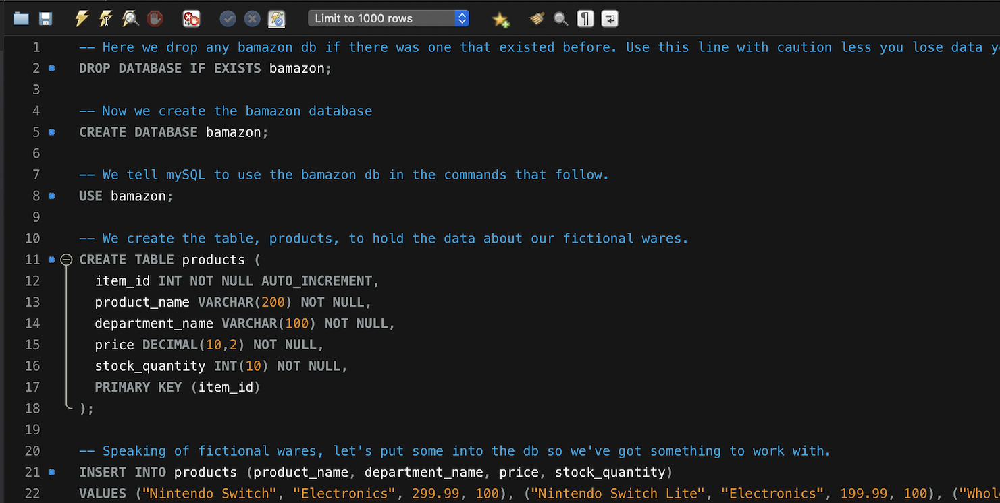
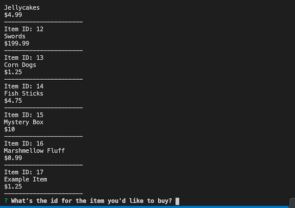
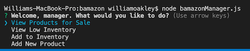

# Welcome to BAMAZON
## (A fictional shopping experience)

This is a project I built to help me get further acquainted with backend development as well as learn about using mySQL databases.

## App Organization
This application is grouped into three primary files. The central one is the bamazon mySQL database. You can find the schema for this database as well as some table data to get started in the bamazon_db.sql file.

Next is bamazonCustomer.js. This file gives customers of Bamazon the ability to see items for sale and make purchases.

The third and final primary file is bamazonManager.js. This file gives bamazonManagers the ability to see inventory, take stock, and add additional items to sell.

## How to BAMAZON!

### Set up your database!
For any of the javascript files to work properly, you'll need to start by setting up your bamazon database. I used mySQL Workbench but feel free to use a different SQL GUI if you prefer. Use the code in bamazon_db.sql to get the database up and running.

### bamazonCustomer.js
1. Navigate to the folder where you've stored the code and run `npm i` to get the node packages you'll need for the app to run correctly.
2. Go to your terminal/bash window and type:
`node bamazonCustomer.js`.
3. You'll be given a list of items that are available.
4. You'll be asked for then item id of the item you'd like to buy. Enter one in.

5. You'll be asked how many you'd like. Again, enter a number.
6. If enough quantity of that item is available, you'll be told your purchase is complete and be given a total cost for your purchase. If there isn't enough quantity, you'll be told that.
7. Hop over to the bamazon database and run `select * from products;` You'll see that the quantity for the item you chose has decreased by the amount you purchased.

Here's a link to a video of the code in action:
 
https://drive.google.com/file/d/1_lc20oyP5d9ev3fo9eLj81MfAFVT31WM/view?usp=sharing

### bamazonManager.js
1. If you haven't already, run `npm i`.
2. Go to your terminal/bash window and type:
`node bamazonManager.js`.
3. You'll be given a list of options to choose from.
 

    - **View Products for Sale:** Similar to the list of items shown in bamazonCustomer.js, but this list includes that quantity of the item in stock.
    - **View Low Inventory:** The same as View Products for Sale, but it only displays items that have a stock quantity of less than five.
    - **Add to Inventory:** You will be asked for an Item ID and how much you would like to ask to add to the stock of that item. The database will then be updated to reflect the added amount.
    - **Add New Product:** Answer a few questions and you can add a new item to the products table in the database. That item can then be seen, purchased, updated, etc., via bamazonCustomer.js or bamazonManager.js.

Here's a link of this code in action:
 
https://drive.google.com/file/d/1XxsQ0NxpzB7VlsXe_rqRNpiYyfTZzKO5/view?usp=sharing

## Tech Used
The big two pieces of technology this project uses is mySQL for our database, and Node.js for our programming. It uses the mysql npm package to allow our Node.js to read and write to the mySQL database. It also uses the inquirer npm package to get the user's input via the CLI in a nice, user-friendly manner.

## About Me:
I'm a wrtier and full stack web developer. You can checkout my portfolio here: 
 https://woaky1.github.io/Responsive-Portfolio/
 Thanks for stopping by!
